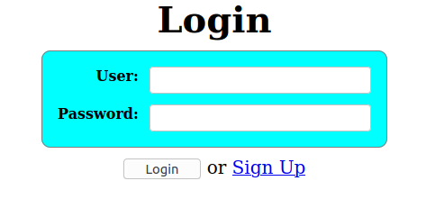
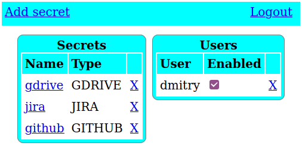

# Birdview
## Abstract
Birdview is a  tool enabling you to assembly your work context in form of list 
of recently done or planned activities and helps to generate detailed stand-up reports.

The tool also tries to group related activities using various hints.

The following types of activity items are supported:
 - Jira tickets
 - Trello cards
 - Github pull requests
 - Google doc documents
 
## Usage
### Running
```
$ docker run --rm -i -p 8888:8888 -v "${HOME}/.birdview":/config black32167/birdview
```
Then open 'http://localhost:8888/' in your browser. You should see login form.



### Configuration
After registering the new user one should be activated in the admin panel.
The default password for 'bv-admin' user ('password') can be overridden using 'BIRDVIEW_ADMIN_PASSWORD' environment variable.
Also, admin panel enables you to configure data source secrets:



To find out how to generate access tokens please refer the following documentation:
- [How To Generate Access Token For Github](https://help.github.com/en/github/authenticating-to-github/creating-a-personal-access-token-for-the-command-line) 
- [How To Generate Access Token For trello](https://developer.atlassian.com/cloud/trello/guides/rest-api/api-introduction/) 
- [How To Generate Access Token For jira](https://confluence.atlassian.com/cloud/api-tokens-938839638.html)
- To get access to the Google Drive you need to register Birdview in the [Google API Console](https://console.developers.google.com/) 

After the configuration is done, login as the new user to explore your work context:


### Update
To pull the fresh version use 'docker pull':
```shell script
$ docker pull black32167/birdview
```